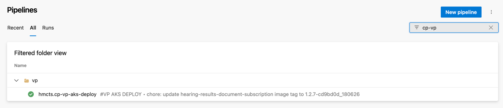
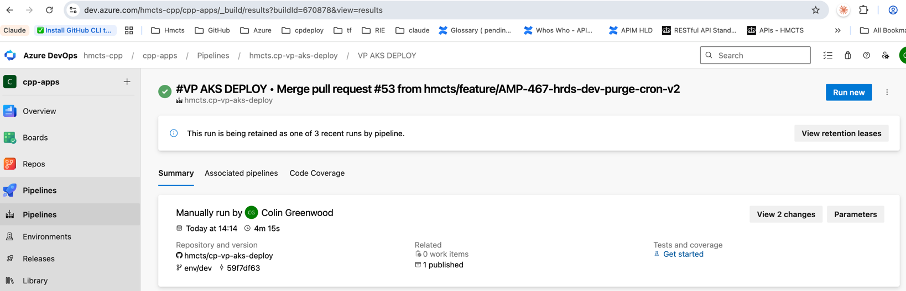
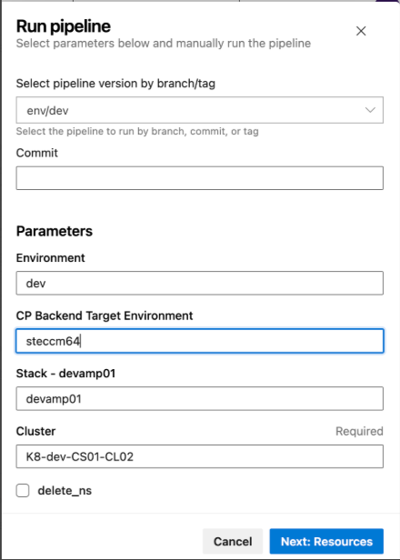

# Deploying to AKS with Helm (VP AKS DEPLOY pipeline)

This service is deployed to the AKS clusters by the **Azure DevOps `VP AKS DEPLOY`
pipeline** in the [hmcts/cp-vp-aks-deploy](https://github.com/hmcts/cp-vp-aks-deploy)
repo. That pipeline Helm-installs the VP services — including
`hearing-results-document-subscription` — onto the target cluster, using the image
tags and values declared in `vp-config/services_values.yml`.

> **Prerequisite:** the image you want to deploy must already be published to ACR
> (the service's own CI: build → publish → ACR copy). The tag that gets deployed is
> set in `cp-vp-aks-deploy` → `vp-config/services_values.yml` under
> `hearing-results-document-subscription` — e.g. bumped by a chore PR such as
> _"update hearing-results-document-subscription image tag to 1.2.7-cd9bd0d_180626"_.

## 1. Find the pipeline

In Azure DevOps (`dev.azure.com/hmcts-cpp`, project **cpp-apps**) open **Pipelines**
and filter for `cp-vp`. Open **`hmcts.cp-vp-aks-deploy`** (under the `vp` folder).

## 2. Run new

On the pipeline page click **Run new** (top right).

## 3. Set the parameters and run

Choose the pipeline branch, fill in the parameters, then **Next: Resources** and run.
The example below targets **dev**:

| Field | Value (dev example) |
|---|---|
| Pipeline version (branch/tag) | `env/dev` |
| Environment | `dev` |
| CP Backend Target Environment | `steccm64` |
| Stack | `devamp01` |
| Cluster (required) | `K8-dev-CS01-CL02` |
| `delete_ns` | leave **unchecked** |

> ⚠️ `delete_ns` deletes the namespace (and everything in it) before deploying —
> only tick it for a deliberate clean re-install.

The run Helm-deploys the services to the chosen cluster. Watch it through to green;
the new image is then live in that environment.

## Updating the deployed image tag

To roll out a new build, bump the `hearing-results-document-subscription` image tag in
`cp-vp-aks-deploy` → `vp-config/services_values.yml` (PR onto the `env/<env>` branch),
then run the pipeline as above.
